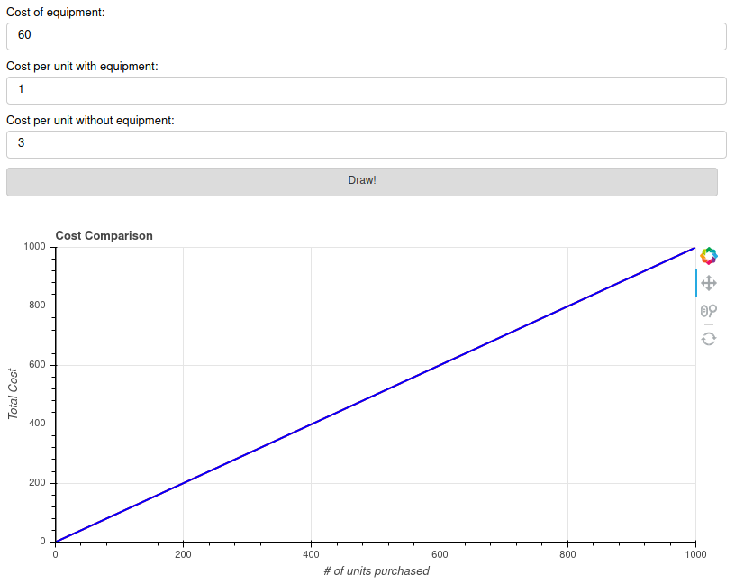

# Am I Saving?

This is an interactive tool that is meant to help people make cost saving decisions about whether to invest in equipment. Equipment could be lots of different things, like at home coffee setups, a car, or maybe renting vs buying a tool.

The project uses mostly python, along with some some html and css. The interactive part is driven by bokeh.

Click [here](https://amisaving.herokuapp.com/myapp) in order to see it live in action! Or view the screenshot below:

